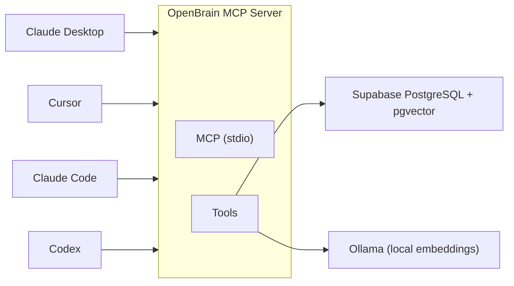

# OpenBrain Shared Memory


An MCP server that gives your AI clients a shared, persistent memory — with a relationship graph built into the database. Tell Claude Desktop something, then ask about it from Cursor or Claude Code later. Same database underneath.

Uses [Supabase](https://supabase.com) PostgreSQL with [pgvector](https://github.com/pgvector/pgvector) and full-text search for hybrid retrieval, [Ollama](https://ollama.com) for local embeddings, and cognitive scoring to rank results by relevance over time.



## How it works

When you store a memory, OpenBrain generates a 768-dimension embedding with Ollama, saves the text and vector to Supabase, and automatically links it to similar memories already in the database.

Searching uses **hybrid retrieval** — combining vector similarity with keyword matching. A search for "us-east-1" finds the exact match instantly via full-text search, while a search for "which AWS region do we use" finds it via semantic understanding. Both run in the same query.

Under the hood, PostgreSQL's built-in `tsvector` full-text search runs alongside pgvector cosine similarity, and results are merged using [Reciprocal Rank Fusion (RRF)](https://en.wikipedia.org/wiki/Reciprocal_rank_fusion). RRF is rank-based, so a document ranking high in both systems naturally surfaces first — no score normalization needed. It runs on Supabase free tier with zero additional infrastructure.

Results are then re-ranked by three cognitive signals:
- **Hybrid retrieval score** — fused semantic + keyword ranking via RRF
- **Temporal priority** — an ACT-R inspired formula that boosts memories based on how frequently and recently they've been accessed
- **Confidence** — a Bayesian trust score that agents can raise (verified) or lower (disputed)

Memories you use often stay sharp, rarely accessed ones fade, and disputed ones drop in ranking without being deleted. The entire pipeline — hybrid retrieval, cognitive scoring, and filtering — runs in a single SQL query with near-zero compute overhead.

## Relationship graph

OpenBrain builds a lightweight relationship graph between memories, entirely inside PostgreSQL. There's no separate graph database to run, no GraphQL API to manage, and no LLM needed to extract entities or build connections.

When you store a memory, OpenBrain compares its embedding against existing memories using HNSW vector search. Any pair above a similarity threshold (default 0.85) gets a weighted edge in the `memory_relationships` table. This happens in a single database round-trip — one HNSW scan, one insert — with no LLM inference in the write path.

The graph supports typed, weighted edges:

| Relationship | What it means |
|---|---|
| `similar` | Auto-created when embeddings are close (cosine similarity) |
| `supports` | Created by `store_decision` — links a decision to the context that informed it |
| `contradicts` | For conflicting information |
| `related` | General-purpose link |
| `follows` | Sequential relationship |
| `derived_from` | One memory built on another |

Once edges exist, you can traverse them. `explore_knowledge` runs a hybrid search to find seed memories, then walks relationship edges via a recursive CTE to pull in connected context — similar to how a graph query expands outward from a starting node. `find_related` starts from a known memory and traverses outward for impact analysis. Both operations run as single SQL queries inside PostgreSQL.

For existing memories that predate auto-linking, `link_unlinked` backfills edges in configurable batches. Lower the threshold (e.g. 0.7) to surface more connections in diverse corpora.

## How it compares

<details>
<summary><strong>Comparison with other agent memory solutions</strong></summary>

Different approaches to agent memory make different trade-offs around where memories live, how they're shared, and what infrastructure you run.

| Approach | Examples | How it works | Strengths | Limitations |
|----------|----------|-------------|-----------|-------------|
| **Built-in memory** | Claude Code auto-memory, Windsurf Memories, Cursor `.cursorrules` | Markdown files on disk, scoped to one client | Zero setup, works out of the box | Siloed per client — Claude Code can't read what Windsurf remembers. No semantic search, just text injection into context |
| **Session capture** | [claude-mem](https://github.com/thedotmack/claude-mem), [claude-memory](https://github.com/idnotbe/claude-memory) | Records tool calls and observations into local SQLite, replays context next session | Rich session history, automatic capture | Local to one machine. Sharing requires exporting/syncing the database. Can be heavy for day-to-day use |
| **Vault-based** | [Nexus](https://github.com/ProfSynapse/claudesidian-mcp), [Obsidian MCP](https://github.com/iansinnott/obsidian-claude-code-mcp) | Stores memories as Markdown files in an Obsidian vault, with optional local embeddings via sqlite-vec | Human-readable graph of notes, Obsidian's linking and tagging UI | Requires Obsidian running as a bridge. Sync across machines needs Obsidian Sync or a file-sync service. Agents not on the same machine can't reach the vault without extra infrastructure |
| **Agent-native** | [OpenClaw](https://docs.openclaw.ai/concepts/memory) | SQLite + Markdown files bundled with the agent runtime | Self-contained, no external services | Tied to the OpenClaw runtime. Each agent has its own database — sharing across different agent frameworks requires custom integration |
| **Learning agent** | [Agent Zero](https://github.com/frdel/agent-zero) | FAISS vector search with LLM-powered memory extraction. Four memory areas (knowledge, conversation fragments, solutions, instruments). LLM consolidation merges and deduplicates automatically | Extracts conversation fragments and problem-solving patterns without explicit calls. LLM consolidation prevents memory bloat. Local FAISS keeps data on your machine | Tied to Agent Zero framework, not a standalone memory service. Needs an LLM for extraction and consolidation (not just retrieval). Local file-based (`.a0proj/memory/`) — sharing across machines requires syncing project directories |
| **Memory platform** | [Mem0 / OpenMemory](https://github.com/mem0ai/mem0) | MCP server backed by Qdrant + PostgreSQL + an LLM for memory extraction. Docker Compose spins up API, Qdrant, and Postgres | Automatic memory extraction from conversations, knowledge graphs (Neo4j optional), managed cloud option, large community (41k+ stars) | Heavier stack — three containers minimum plus an LLM for memory processing (defaults to OpenAI, needs an API key). Can [struggle with context isolation](https://mem0.ai/blog/introducing-openmemory-mcp) between projects |
| **Knowledge engine** | [Cognee](https://github.com/topoteretes/cognee) | LLM-powered pipeline that extracts entities and relationships from documents, builds a knowledge graph, and refines it over time. MCP server available | Builds knowledge graphs from unstructured data, supports 38+ data types, self-improving ("memify" prunes stale nodes, strengthens frequent connections). Multi-tenant. [MCP shared mode](https://www.cognee.ai/blog/cognee-news/introducing-cognee-mcp) lets multiple clients share one graph | Needs an LLM for graph-building (OpenAI default; self-hosted needs [32B+ models](https://www.glukhov.org/post/2025/12/selfhosting-cognee-quickstart-llms-comparison/)). Open-source self-host is free, [cloud has a free tier with paid plans from $35/month](https://www.cognee.ai/pricing). More infrastructure than a memory store — you're running a knowledge pipeline |
| **Cognitive database** | [MuninnDB](https://github.com/scrypster/muninndb) | Single-binary database with ACT-R decay, Hebbian co-activation, and Bayesian confidence as engine-native primitives | Purpose-built for cognitive memory — sub-20ms ACTIVATE queries, association learning across time, predictive retrieval. No LLM needed | New project, smaller ecosystem. Dedicated binary to run rather than leveraging existing infrastructure |
| **Shared database** | **OpenBrain** (this project) | MCP server backed by Supabase PostgreSQL + pgvector. Any MCP client connects to the same database. Relationship graph built with SQL — no separate graph DB | Lightweight — one server, one database, local embeddings via Ollama. No LLM needed for memory operations or graph-building. Cognitive scoring ranks by usage patterns. Auto-linking and graph traversal run as SQL queries inside PostgreSQL | Requires a Supabase project (free tier works) and Ollama. No automatic memory extraction — you store what you choose to (or use hooks and skills to automate it) |

### OpenBrain vs Mem0 vs Cognee vs Agent Zero

Four ways to do agent memory, each with different infrastructure and portability trade-offs.

**Mem0** uses an LLM to extract and deduplicate memories from conversations, supports knowledge graphs via Neo4j, and has a managed cloud option. A full deployment runs three containers (API, Qdrant, Postgres) plus an LLM.

**Cognee** adds a knowledge graph on top — an LLM pipeline extracts entities and relationships from your data, then refines the graph over time. If your agents need to understand how concepts relate rather than just recall text, this is the heaviest option. An LLM runs on every ingestion step, self-hosting recommends 32B+ models, and [cloud has a free tier](https://www.cognee.ai/pricing) (paid plans from $35/month).

**Agent Zero** bakes memory into the agent framework itself. It extracts conversation fragments and problem-solving patterns via LLM, then consolidates them (merge, update, keep separate, or skip) to prevent bloat. Four memory areas — knowledge, fragments, solutions, instruments — organize what gets stored, and FAISS handles local vector search. The trade-off: it only works inside Agent Zero, and memories live in local project directories.

**OpenBrain** does not run an LLM to process memories — it embeds and indexes what you give it, then ranks results with cognitive scoring (recency, frequency, confidence) on top of hybrid search. Relationships between memories are discovered by embedding similarity and stored as weighted edges in PostgreSQL, traversable via recursive CTEs. One MCP server, one database, one local embedding model. Automation comes from the client side (CLAUDE.md instructions, hooks, `/save-learnings`) rather than a server-side LLM.

| | Mem0 / OpenMemory | Cognee | Agent Zero | OpenBrain |
|---|---|---|---|---|
| **Architecture** | MCP server + 3 containers | MCP server + graph/vector backends | Built into agent framework | MCP server + Supabase |
| **Vector store** | Qdrant | Qdrant, LanceDB, Milvus, pgvector, or others | FAISS (local files) | pgvector (inside Supabase) |
| **Graph store** | Neo4j (optional) | Neo4j, Kuzu, FalkorDB, or NetworkX | None | PostgreSQL (recursive CTEs, no separate graph DB) |
| **LLM required** | Yes, for memory extraction | Yes, for entity/relationship extraction | Yes, for extraction + consolidation | No |
| **Embeddings** | OpenAI (default) or self-hosted | OpenAI, Ollama, or others | 100+ providers via LiteLLM | Ollama local (default) or OpenAI |
| **Memory creation** | Automatic (LLM extracts from conversations) | Automatic (LLM builds knowledge graph) | Automatic (LLM extracts fragments + solutions) | Explicit (`store_memory`, or hooks/skills automate it) |
| **Memory areas** | Flat | Graph nodes + relationships | 4 areas (knowledge, fragments, solutions, instruments) | Profiles (partitioned by use case) |
| **Ranking** | Semantic similarity | Graph traversal + vector search | Cosine similarity + metadata filtering | Hybrid search + cognitive scoring (ACT-R + confidence) |
| **Graph building** | LLM entity extraction (optional) | LLM pipeline (required) | None | Embedding similarity — auto-linked on store, no LLM |
| **Consolidation** | LLM deduplication | Memify prunes/strengthens graph | LLM decides: merge, update, keep separate, or skip | Manual (`reinforce_memory`, `contradict_memory`) |
| **Cross-client sharing** | Yes (MCP server) | Yes (MCP server) | No (framework-bound, local files) | Yes (MCP server, shared database) |
| **Cross-machine sharing** | Yes (cloud or self-hosted server) | Yes (cloud or self-hosted) | No (sync `.a0proj/memory/` manually) | Yes (Supabase cloud or self-hosted PostgreSQL) |
| **Managed cloud** | Yes (mem0.ai) | Yes (free tier, paid from $35/month) | No | No (Supabase free tier, self-host PostgreSQL) |

</details>

### Why a shared database matters

Most solutions store memories locally — on disk, in SQLite, in a vault folder — and then face a synchronisation problem when you want to share across machines or clients. OpenBrain sidesteps this by putting the database in the cloud from the start. The MCP server is stateless; it just connects your client to the shared store. Add the server to a new machine and your memories are already there.

This is a trade-off, not a free win. Local-only solutions are simpler to set up and keep all data on your machine. OpenBrain requires a database and an embedding service, and your memories live in Supabase (though you can [self-host PostgreSQL](#self-hosting-without-supabase) if that matters). For teams and multi-device workflows, a shared database is less overhead than cobbling together file sync for Markdown memories.

## Quick start

You need a Supabase project (free tier works) and Ollama for local embeddings.

<details>
<summary><strong>Docker setup</strong></summary>

### Prerequisites

| What | Where to get it |
|------|-----------------|
| Docker | [docker.com](https://docs.docker.com/get-docker/) or [OrbStack](https://orbstack.dev/) (Mac) |
| Ollama | [ollama.com/download](https://ollama.com/download) |
| Supabase project | [supabase.com/dashboard](https://supabase.com/dashboard) |

### Build

```bash
git clone <repo-url> openbrain-sharedmemory
cd openbrain-sharedmemory
docker build -t openbrain-sharedmemory .
```

### Set up Ollama

```bash
ollama pull embeddinggemma       # ~600 MB download
ollama serve                     # if not already running
```

### Create the database

In Supabase: SQL Editor > New query > paste [`sql/schema.sql`](sql/schema.sql) > Run.

### Configure

```bash
cp .env.example .env
```

Fill in `SUPABASE_URL` and `SUPABASE_KEY` (use the `service_role` key from Supabase Dashboard > Settings > API).

### Verify

```bash
docker run --rm -i --env-file .env \
  --add-host=host.docker.internal:host-gateway \
  openbrain-sharedmemory
```

You should see the [FastMCP](https://gofastmcp.com) banner. Ctrl+C to stop.

</details>

<details>
<summary><strong>Native setup (UV, no Docker)</strong></summary>

Requires Python 3.13+ and [UV](https://docs.astral.sh/uv/getting-started/installation/).

```bash
cd openbrain-sharedmemory
uv sync
uv run openbrain
```

Follow the same Ollama, database, and `.env` steps as Docker setup above.

</details>

## Connect your AI clients

Each client spawns the MCP server as a subprocess. Replace `/absolute/path/to/openbrain-sharedmemory/.env` with the real path on your machine.

| Client | Config location | Top-level key | Format |
|--------|----------------|---------------|--------|
| Claude Desktop (macOS) | `~/Library/Application Support/Claude/claude_desktop_config.json` | `mcpServers` | JSON |
| Cursor | `~/.cursor/mcp.json` | `mcpServers` | JSON |
| Claude Code (global) | `~/.claude.json` | `mcpServers` | JSON |
| Claude Code (project) | `.mcp.json` | `mcpServers` | JSON |
| VS Code | `.vscode/mcp.json` or user config | `servers` | JSON |
| Codex | `~/.codex/config.toml` | `[mcp_servers.*]` | TOML |
| Windsurf | `~/.windsurf/mcp.json` | `mcpServers` | JSON |

Restart the client after editing config (except Claude Code and Codex, which pick up changes on next invocation).

<details>
<summary><strong>Docker client configs</strong></summary>

**Claude Desktop / Cursor / Claude Code / Windsurf** (JSON clients):

```json
{
  "mcpServers": {
    "openbrain": {
      "command": "docker",
      "args": [
        "run", "--rm", "-i",
        "--env-file", "/absolute/path/to/openbrain-sharedmemory/.env",
        "--add-host=host.docker.internal:host-gateway",
        "openbrain-sharedmemory"
      ]
    }
  }
}
```

**VS Code** (`.vscode/mcp.json`):

```json
{
  "servers": {
    "openbrain": {
      "type": "stdio",
      "command": "docker",
      "args": [
        "run", "--rm", "-i",
        "--env-file", "/absolute/path/to/openbrain-sharedmemory/.env",
        "--add-host=host.docker.internal:host-gateway",
        "openbrain-sharedmemory"
      ]
    }
  }
}
```

**Codex** (`~/.codex/config.toml`):

```toml
[mcp_servers.openbrain]
command = "docker"
args = [
  "run", "--rm", "-i",
  "--env-file", "/absolute/path/to/openbrain-sharedmemory/.env",
  "--add-host=host.docker.internal:host-gateway",
  "openbrain-sharedmemory"
]
enabled = true
```

**Claude Code via CLI:**

```bash
claude mcp add openbrain -- docker run --rm -i \
  --env-file /absolute/path/to/openbrain-sharedmemory/.env \
  --add-host=host.docker.internal:host-gateway \
  openbrain-sharedmemory
```

</details>

<details>
<summary><strong>Native (UV) client configs</strong></summary>

**Claude Desktop / Cursor / Claude Code / Windsurf** (JSON clients):

```json
{
  "mcpServers": {
    "openbrain": {
      "command": "uv",
      "args": ["run", "--directory", "/absolute/path/to/openbrain-sharedmemory", "openbrain"]
    }
  }
}
```

**VS Code** (`.vscode/mcp.json`):

```json
{
  "servers": {
    "openbrain": {
      "type": "stdio",
      "command": "uv",
      "args": ["run", "--directory", "/absolute/path/to/openbrain-sharedmemory", "openbrain"]
    }
  }
}
```

**Codex** (`~/.codex/config.toml`):

```toml
[mcp_servers.openbrain]
command = "uv"
args = ["run", "--directory", "/absolute/path/to/openbrain-sharedmemory", "openbrain"]
enabled = true
```

</details>

### Try it out

> "Remember that our Azure resource groups use the naming convention `{env}-{service}`"

Then in the same client, or a different one:

> "What do you know about our Azure resource naming conventions?"

It works across clients because they all hit the same Supabase database.

## Tools

Your AI client calls these automatically when you ask it to remember or look things up.

### Core memory

| Tool | What it does |
|------|-------------|
| `store_memory(content, source?, tags?, metadata?, auto_link?)` | Embeds and stores text in the active profile. Auto-links to similar memories by default |
| `hybrid_search(query, limit?, tags?, source?)` | Hybrid search — finds memories by meaning and keywords, ranked by relevance |
| `list_recent(limit?, source?, tags?)` | Shows recent memories in the active profile |
| `delete_memory(memory_id)` | Removes a memory by UUID |
| `update_memory(memory_id, content?, tags?, metadata?)` | Edits a memory (re-embeds if content changes) |

### Knowledge graph

| Tool | What it does |
|------|-------------|
| `explore_knowledge(query, depth?, min_strength?, limit?, tags?, source?)` | Searches for memories then traverses relationship edges to pull in connected context |
| `find_related(memory_id, relationship_types?, depth?, min_strength?, limit?)` | Traverses the graph outward from a known memory — impact analysis |
| `store_decision(decision, rationale, alternatives?, tags?, related_memories?, source?)` | Stores a decision with structured metadata and `supports` edges to related memories |
| `link_unlinked(batch_size?, threshold?, max_links?)` | Backfills auto-links for memories that predate the relationship graph |

### Confidence and scoring

| Tool | What it does |
|------|-------------|
| `reinforce_memory(memory_id, strength?)` | Boost a memory's confidence (mark as verified) |
| `contradict_memory(memory_id, strength?)` | Lower a memory's confidence (mark as disputed) |

### Profiles and administration

| Tool | What it does |
|------|-------------|
| `switch_profile(profile)` | Switch memory partition (e.g. "work", "personal") |
| `current_profile()` | Show which profile is active |
| `list_profiles()` | List all profiles and their memory counts |
| `set_profile_ttl(profile, ttl_days?)` | Set memory expiration policy for a profile |
| `cleanup_expired()` | Delete expired memories in active profile |
| `get_stats()` | Count, source breakdown, top tags for the active profile |
| `health_check()` | Diagnose connection issues (Supabase, embedding provider, config) |
| `get_cache_stats()` | Embedding cache size, hit rate, evictions |
| `re_embed_all()` | Re-generates all embeddings in the active profile (with progress reporting) |
| `export_profile(format?)` | Export memories as JSON or Markdown |
| `import_memories_tool(data, dedup_threshold?)` | Import memories from a JSON export |

## Cognitive scoring

Search results are ranked by `relevance`, not just raw vector similarity. OpenBrain tracks how often each memory is accessed and when, then applies an [ACT-R](https://act-r.psy.cmu.edu/) base-level activation formula at query time:

```
relevance = rrf_score * softplus(ACT-R) * confidence * graph_boost
```

Where `rrf_score` is the Reciprocal Rank Fusion score from hybrid retrieval, ACT-R = `ln(n + 1) - 0.5 * ln(ageDays / (n + 1))` (n = access count, ageDays = time since last access), confidence is a Bayesian trust score (0 to 1, default 0.5), and graph_boost = `1 + sum(relationship_strengths) * 0.2` rewards well-connected memories.

This means:
- A memory accessed 10 times this week ranks higher than one accessed once two years ago, even if both have similar embeddings
- Brand-new memories with zero access get a neutral score — they aren't penalized
- The scoring runs entirely in PostgreSQL with no extra compute, model inference, or round trips
- Well-connected memories (many relationships in the knowledge graph) get a centrality boost — isolated memories are unaffected

Each memory also carries a **confidence** score. When you verify a memory is accurate, call `reinforce_memory` to boost its confidence. When a memory is outdated or wrong, call `contradict_memory` to lower it. Low-confidence memories rank lower without being deleted, so they're still findable but won't surface first.

The scoring borrows from [ACT-R](https://act-r.psy.cmu.edu/) cognitive theory and runs as a re-ranking layer inside Supabase — no extra services needed.

## Profiles

Inspired by the TV series [Severance](https://tv.apple.com/us/show/severance/umc.cmc.1srk2goyh2q2zdxcx605w8vtx) — each profile is a separate memory partition. When you're in "work" mode, personal memories don't exist, and vice versa.

```
> "Switch to my work profile"
> "Remember that the prod database is on us-east-1"
> "Switch to personal profile"
> "Search for database"       <-- returns nothing, work memories are invisible
```

The default profile is "default". Set `DEFAULT_PROFILE` in `.env` to change it. Profiles are created automatically when you store a memory. Switching is instant and lasts for the session only.

## Memory expiration

Set a TTL on any profile so memories automatically expire:

> "Set a 90-day TTL on my work profile"

Expired memories are automatically filtered from all searches and listings. Run `cleanup_expired()` to permanently delete them and reclaim storage. Pass `None` to remove a TTL.

## Automatic memory capture

You don't have to call `store_memory` manually. Two approaches work together:

**CLAUDE.md instruction** — add a prompt to your project's `CLAUDE.md` telling the AI to save learnings as it works. See the project's own `CLAUDE.md` for an example.

**`/save-learnings` skill** — a Claude Code skill that reviews the session's git diff, rates candidate memories for quality, deduplicates against existing memories, and stores what's worth keeping. Run it at the end of a work session.

<details>
<summary><strong>Skill details and hooks</strong></summary>

The `/save-learnings` skill applies quality gates before storing anything:

- **Gate check** — trivial sessions (just reading files, typo fixes) exit without storing
- **Quality rating** — memories rated 1-5; anything below 3 is dropped
- **Mandatory dedup** — searches at 0.8 similarity; updates existing memories rather than duplicating
- **Quality tags** — every memory gets a `quality:N` tag for analysis

You can automate it with Claude Code hooks in `~/.claude/settings.json`:

**After a git commit:**

```json
{
  "PostToolUse": [
    {
      "matcher": "Bash",
      "hooks": [
        {
          "type": "prompt",
          "prompt": "A Bash command just ran. Check if it was a 'git commit' that succeeded. If it was NOT a git commit, return 'approve' and do nothing. If it WAS a successful git commit, return 'block' with this message: 'A commit just landed. Run /save-learnings to capture decisions, gotchas, or patterns from this work. Skip if the commit was trivial (typo fix, formatting, dependency bump).'",
          "timeout": 10
        }
      ]
    }
  ]
}
```

**At session end:**

```json
{
  "Stop": [
    {
      "matcher": "*",
      "hooks": [
        {
          "type": "prompt",
          "prompt": "The session is ending. Evaluate whether this session had meaningful work worth remembering: code changes, architectural decisions, debugging breakthroughs, configuration discoveries, or non-obvious patterns. If the session was short (just questions, reading files, or trivial edits), return 'approve' to let the session end. If meaningful work happened, return 'block' with: 'Before ending, run /save-learnings to capture what was learned. Focus on decisions made, gotchas discovered, and patterns worth reusing.'",
          "timeout": 15
        }
      ]
    }
  ]
}
```

Hooks can't call the skill directly — they inject guidance into the conversation, and the agent runs `/save-learnings` itself.

</details>

## CLI

```bash
openbrain serve              # Start MCP server (default)
openbrain health             # Check connectivity
openbrain profiles           # List profiles and counts
openbrain stats              # Show profile statistics
openbrain search "query"     # Semantic search
openbrain list               # List recent memories
openbrain cleanup            # Remove expired memories
openbrain export -o backup.json  # Export memories
openbrain import backup.json     # Import memories
openbrain openapi            # Generate OpenAPI spec
```

## MCP Prompts

| Prompt | What it does |
|--------|-------------|
| `summarize-recent` | Retrieves recent memories and asks for a summary |
| `find-decisions` | Searches for decision-type memories about a topic |
| `profile-overview` | Shows stats and recent activity for the current profile |
| `cleanup-check` | Previews what expired memory cleanup would remove |

## Embedding providers

Ollama is the default — free, local, your data stays on your machine.

| Provider | Model | Dimensions | Notes |
|----------|-------|-----------|-------|
| Ollama | [`embeddinggemma`](https://ai.google.dev/gemma/docs/core/embedding) | 768 | Default, best retrieval quality + 2048 token context |
| Ollama | [`mxbai-embed-large`](https://ollama.com/library/mxbai-embed-large) | 1024 | Previous default, 512 token context |
| OpenAI | [`text-embedding-3-small`](https://platform.openai.com/docs/guides/embeddings) | 1024 | Set `EMBEDDING_PROVIDER=openai` and `OPENAI_API_KEY` |

Vectors from different models are incompatible. After switching providers, run `re_embed_all` to regenerate all embeddings.

> **Note:** Anthropic (Claude) does not offer an embedding model. If you only have an Anthropic API key, use Ollama for embeddings -- it's free and runs locally.

## Temporal search

Search queries with time expressions like "last week" or "three months ago" are resolved automatically using parsedatetime -- no configuration needed. This handles roughly 80% of temporal queries at zero cost.

For expressions that parsedatetime cannot parse ("the quarter before last", "around Thanksgiving"), set `TEMPORAL_LLM_MODEL` to call an LLM as a fallback:

```bash
# Self-hosted with Ollama (free, local)
TEMPORAL_LLM_MODEL=ollama/llama3.2

# Cloud API
TEMPORAL_LLM_MODEL=gpt-4o-mini
```

Any [litellm](https://docs.litellm.ai/docs/providers)-compatible model string works -- `deepseek/deepseek-chat`, `moonshot/moonshot-v1-8k`, etc. The LLM is only called when parsedatetime fails and the query has temporal intent, so costs stay near zero.

If `TEMPORAL_LLM_MODEL` is empty (the default), parsedatetime handles everything on its own. Requires the `litellm` package (`pip install litellm` or install Ogham with the appropriate extra).

## Performance

Measured on Apple Silicon M1 with `embeddinggemma`:

| What | Number |
|------|--------|
| Docker image | 243 MB |
| Model download (once) | ~600 MB |
| Model in GPU memory (Metal) | <200 MB |
| Embedding, first call | ~500ms |
| Embedding, warm | 70-120ms |

The model runs on GPU via Metal. After 5 minutes idle, Ollama unloads it — the next call takes ~500ms to reload.

<details>
<summary><strong>Benchmark and stress test results</strong></summary>

All benchmarks run against **Supabase free tier** with **Ollama on Apple Silicon M1** for embedding generation.

### Benchmark (10 memories, `tests/bench.py`)

| Operation | Mean | Median |
|---|---|---|
| Embedding (cold) | ~90 ms | ~85 ms |
| Embedding (cached) | <0.1 ms | <0.1 ms |
| Store memory | ~65 ms | ~64 ms |
| Vector search (DB only) | ~65 ms | ~64 ms |
| Hybrid search (DB only) | ~65 ms | ~64 ms |
| Auto-link (HNSW scan) | ~65 ms | ~65 ms |
| Explore graph (search + CTE) | ~69 ms | ~69 ms |
| Get related (CTE traversal) | ~65 ms | ~64 ms |

Search timings exclude embedding generation so you can see database latency in isolation. Auto-link, explore graph, and get related add minimal overhead on top of base search — the relationship graph operations are cheap.

### Stress test (1000 memories, `tests/bench_stress.py`)

Imports a subset of real conversation memories from a 4,588-memory export, then benchmarks graph operations at scale. SQLite embedding cache is cleared before the cold import to measure true embedding latency.

| Phase | Result |
|---|---|
| Cold import (no dedup) | 58.6s total, **58.6 ms/memory** |
| Re-import (dedup) | 2.7s total, 2.7 ms/memory — **1000/1000 skipped** |
| Auto-link backfill | 7 memories linked in 4 batches, 1.5s total |
| Hybrid search | **117 ms** mean, 109 ms median |
| Explore graph (search + CTE) | **110 ms** mean, 112 ms median |
| Get related (CTE traversal) | **85 ms** mean, 83 ms median |

At the default 0.85 similarity threshold, auto-linking is conservative — only 7 out of 1000 conversational memories were similar enough to link. Lowering to 0.7 surfaces more connections (52 out of 4,242 in production). The threshold is configurable per call.

See [`tests/BENCH.md`](tests/BENCH.md) for details on running benchmarks and comparing baselines across embedding models.

</details>

## Resilience

- **Retries** — transient failures retried with exponential backoff
- **Startup checks** — fails fast with clear messages if Supabase or Ollama aren't reachable
- **Input validation** — bad parameters get clear error messages
- **Profile isolation** — memories never leak between profiles

## Development

```bash
# Setup
uv sync --extra dev                        # install dependencies + dev tools

# Run the server
uv run openbrain serve                     # start MCP server (stdio)
uv run openbrain health                    # check Supabase + Ollama connectivity

# Tests
uv run pytest tests/ -v                    # all tests
uv run pytest -m 'not integration'         # unit tests only (no external services)
uv run pytest tests/test_integration.py -v # integration tests (needs Supabase + Ollama)

# Lint
uv run ruff check src/ tests/             # lint
uv run ruff format src/ tests/            # format

# Benchmarks (needs Supabase + Ollama)
uv run python tests/bench.py              # measure embedding, store, search latency
uv run python tests/bench.py --json       # machine-readable output
uv run python tests/bench_stress.py --count 1000  # stress test with 1000 memories
```

<details>
<summary><strong>Project layout</strong></summary>

```
openbrain-sharedmemory/
├── Dockerfile
├── docker-compose.yml
├── pyproject.toml
├── .env.example
├── sql/
│   ├── schema.sql              # Run in Supabase SQL Editor
│   └── migrations/             # Incremental schema updates
├── src/openbrain/
│   ├── app.py                  # FastMCP instance
│   ├── server.py               # Entry point (with startup validation)
│   ├── config.py               # pydantic-settings from .env
│   ├── database.py             # Supabase queries
│   ├── embeddings.py           # Ollama / OpenAI embedding generation
│   ├── embedding_cache.py      # Persistent SQLite embedding cache
│   ├── health.py               # Health check functions
│   ├── retry.py                # Retry logic with exponential backoff
│   ├── cli.py                  # CLI tool (typer)
│   ├── export_import.py        # Export/import logic
│   ├── http_health.py          # HTTP health endpoint
│   ├── openapi.py              # OpenAPI spec generator
│   ├── prompts.py              # MCP prompt templates
│   └── tools/
│       ├── memory.py           # store, search, graph, decisions, admin
│       └── stats.py            # get_stats
├── tests/
│   ├── test_tools.py           # Unit tests (mocked)
│   ├── test_integration.py     # Integration tests (real Supabase + Ollama)
│   ├── test_embedding_cache.py # SQLite cache tests
│   ├── test_export_import.py
│   ├── test_retry.py
│   ├── test_prompts.py
│   ├── test_http_health.py
│   ├── test_cli.py
│   ├── test_openapi.py
│   ├── bench.py                # Performance benchmark
│   └── bench_stress.py         # Stress test (1000+ memories)
├── docs/
│   ├── openapi.json
│   └── plans/
├── BACKLOG.md
├── CHANGELOG.md
└── README.md
```

</details>

<details>
<summary><strong>Self-hosting (without Supabase)</strong></summary>

All Supabase interaction lives in `src/openbrain/database.py`. To self-host:

1. Set up PostgreSQL 15+ with pgvector
2. Run `sql/schema.sql` against it (standard Postgres, no Supabase-specific bits)
3. Rewrite `database.py` to use `psycopg` or `asyncpg` instead of the Supabase client
4. Update `.env` — replace `SUPABASE_URL` and `SUPABASE_KEY` with your own connection vars (e.g. `DATABASE_URL` or `POSTGRES_HOST`/`POSTGRES_PORT`/`POSTGRES_DB`/`POSTGRES_PASSWORD`). Update `config.py` to match whatever your new `database.py` expects

</details>

<details>
<summary><strong>Troubleshooting</strong></summary>

**Ollama connection refused** — Run `ollama serve`. If using Docker, check that `--add-host=host.docker.internal:host-gateway` is in your run command.

**"operator does not exist: extensions.vector"** — Re-run `sql/schema.sql` in Supabase SQL Editor. The `match_memories` function sets `search_path = public, extensions` to find pgvector operators.

**Supabase 401 or 403** — Switch from the `anon` key to the `service_role` key in `.env`.

**Embedding dimension mismatch** — `EMBEDDING_DIM` in `.env` must match the `vector(N)` column width in the database. If you change dimensions, you also need to `ALTER TABLE memories ALTER COLUMN embedding TYPE vector(N)`, update function signatures that reference the old dimension, then run `re_embed_all`.

**Docker can't reach Ollama** — Ollama must be running on the host (`ollama serve`), and the container needs `--add-host=host.docker.internal:host-gateway`. If your `.env` sets `OLLAMA_URL=http://localhost:11434`, this will also fail in Docker because `localhost` inside a container refers to the container itself, not the host. Either remove `OLLAMA_URL` from `.env` (the Dockerfile defaults to `http://host.docker.internal:11434`) or set it to `http://host.docker.internal:11434` when running via Docker.

**Health check shows Ollama error but everything else works** — If you're running natively (not Docker) and Ollama is running, this is fine. If you're running via Docker, see "Docker can't reach Ollama" above.

**"Could not find the function public.get_profile_counts"** — Re-run `sql/schema.sql` to create the RPC functions.

**Startup fails with connection errors** — Verify `SUPABASE_URL` and `SUPABASE_KEY` in `.env` (Dashboard > Settings > API).

</details>

## What's next?

See [BACKLOG.md](BACKLOG.md) for future ideas including Hebbian co-activation tracking and predictive activation.

See [CHANGELOG.md](CHANGELOG.md) for release history.
